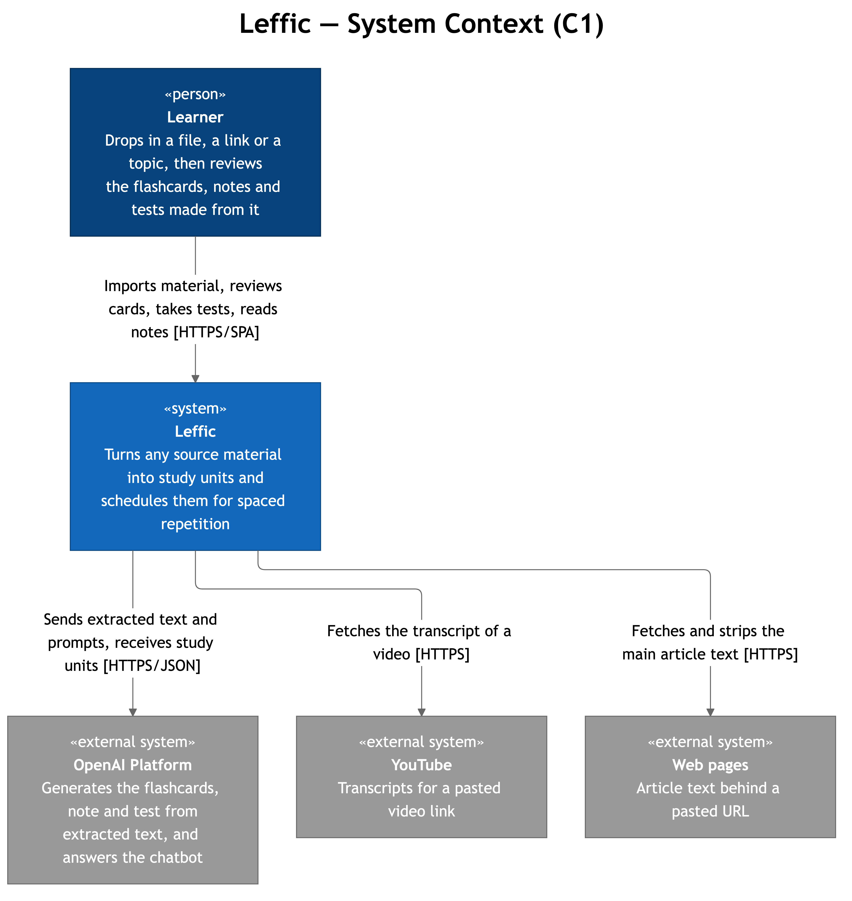

# Leffic

Turn any file, link or topic into flashcards, a note and a test, then
review them exactly when you are about to forget.

## Demo

[Video](https://drive.google.com/file/d/1QQh3qZqyipiuo7TKyoSCjWW-QDhHSaZe/view?usp=sharing)

## What it does

Drop material into a folder and one import fans out into three generations
at once: a flashcard deck, a written note and a multiple-choice test. The
folder then shows what is due today across itself and every subfolder
beneath it.

| Area | What you can do |
|---|---|
| Folders | Nest them freely; `home` resolves to your own root folder |
| Import | From a file, a web page, a YouTube transcript, or a bare topic |
| Flashcards | Again / Hard / Good / Easy, each labelled with its next interval |
| Tests | Multiple choice, paginated, resumable, with a result screen |
| Notes | Generated HTML, marked read on open, with a reading-time estimate |
| Files | Any uploaded format is converted to PDF for viewing |
| Mixed review | Every due card or test item across a folder and its subtree |
| Ask | A general-purpose chatbot panel |

## Requirements

- Docker and Docker Compose
- An `OPENAI_API_KEY`

## Running it

```bash
docker compose up --build
```

The web app is on <http://localhost:3009>, the gateway on
<http://localhost:8888>. Nothing else publishes a port.

Set `OPENAI_API_KEY`, `JWT_SECRET_KEY` and the Postgres credentials from
`docker-compose.yml`.

The refresh cookie carries `Secure` by default. The local stack serves
plain HTTP, so Compose sets `REFRESH_COOKIE_SECURE=false`; leave it unset
wherever the gateway terminates TLS.

## Architecture

Seven deployables and four datastores. No service calls another over
HTTP: the only cross-service traffic is the `user.deleted` event on
RabbitMQ. Every backend service is FastAPI on
Python 3.12 with the same layout — `run.py` → `app_factory.py` →
`features/` and `shared/`. Two of the deployables are background workers
built from the content service image: the Celery generation worker and the
user-events consumer.

<p align="center">
  
  <br>
  <em>Who uses Leffic and what it talks to.</em>
</p>

<p align="center">
  
  <br>
  <em>The pieces inside it and how they communicate.</em>
</p>

| Service | Holds | Talks to |
|---|---|---|
| `ui-service` | SolidJS SPA, built by Vite, served by nginx | the gateway |
| `api-gateway` | nginx with njs; verifies the JWT and applies CORS | every service |
| `user-service` | Accounts, sealed AI provider keys, and the only JWT issuer | Postgres `users`, RabbitMQ |
| `content-management-service` | Folders, decks, cards, tests, notes, files, reviews, scheduling, generation and the chatbot | Postgres `content`, OpenAI |
| `content-documents` | Upload, extract-text and file, on an image with LibreOffice and OCR | Postgres `content`, the file volume |
| `celery-worker` | The three generation tasks, same image as the content service | OpenAI, Postgres `content` |
| `user-events-consumer` | Removes a deleted account's content, same image as the content service | RabbitMQ, Postgres `content` |

### How an import flows

The browser uploads a file to the documents deployable, which stores the
bytes and the row itself, then asks it to extract the text. You review that
text, and the content API enqueues one Celery task per study-unit type. The
browser polls each signed task token until it succeeds — a token names the
folder it was minted for, so another learner cannot poll it — and the
worker writes each finished study unit straight to the content database.
All four deployables are built from `content-management-service`; only the
documents image carries LibreOffice and OCR.

Deleting an account publishes a durable `user.deleted` event to RabbitMQ
before the account row goes, and a consumer on the content side removes that
learner's folders, study units and uploaded documents.

## Data

| Store | Engine | Holds |
|---|---|---|
| `users` | PostgreSQL | accounts, password hashes |
| `content` | PostgreSQL | folders, decks, flashcards, tests, sessions, notes, files, reviews |
| `files` | Docker volume | the uploaded documents themselves |
| Redis | — | Celery broker and result backend |

Each Python service owns an Alembic migration history. Docker Compose runs the
two migration jobs before starting services that use their databases. A user's
root folder is the folder whose id equals their user id.

## Tech stack

- SolidJS, TypeScript, Vite
- Vitest, fast-check
- FastAPI, SQLAlchemy, Pydantic
- nginx with njs
- Celery, Redis
- PostgreSQL
- OpenAI
- py-fsrs
- Docker Compose

## License

This project is licensed under the Creative Commons Attribution-NonCommercial 4.0 International License.  
See the [LICENSE](./LICENSE) file for details.

[](https://creativecommons.org/licenses/by-nc/4.0/)
